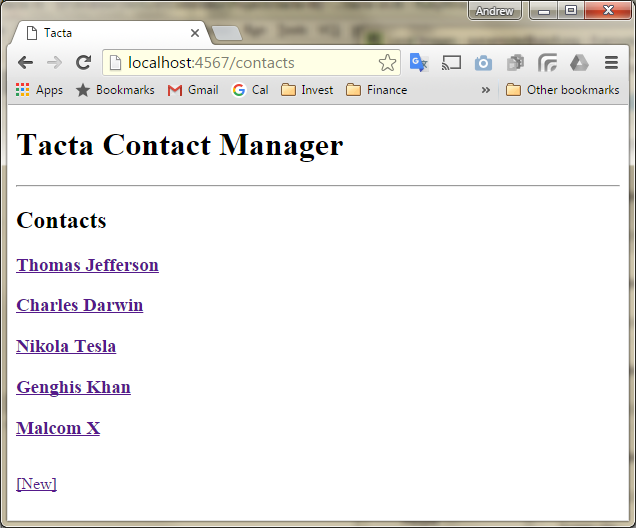

## Sinatra Application

Web interface for Tacta contacts manager.

```
> gem install sinatra
```

File: tacta-sn.rb

```
require 'sinatra'

set :port, 4567

get '/' do
   "<h1>Tacta Contact Manager</h1>"
end
```

Run server

```
> ruby tacta-sn.rb

[2016-03-11 16:23:22] INFO  WEBrick 1.3.1
[2016-03-11 16:23:22] INFO  ruby 2.1.7 (2015-08-18) [i386-mingw32]
== Sinatra (v1.4.7) has taken the stage on 4567 for development with backup from WEBrick
[2016-03-11 16:23:22] INFO  WEBrick::HTTPServer#start: pid=6396 port=4567
```

Navigate in broswer to

```
http://localhost:4567/
```


## List Contacts

Display list of contacts

Add a second handler for the route /contacts

```
get '/' do
   # ...
end

get '/contacts' do
   # ...
end
```

Load the contacts file using the JSON file code from the pure ruby example.  Store in an instance variable.

```
require './contacts_file'

get '/contacts' do
   @contacts = read_contacts
   # ...
end
```

Use 'erb' to render a view template for the index listing.

```
get '/contacts' do
   @contacts = read_contacts
   erb :'contacts/index'
end
```

Create the embeded ruby html template.  Sinatra looks for templates in the views folder.

List the contacts from `@contacts`.

File: `views/contacts/index.erb`
```
<h2>Contacts</h2>

<% @contacts.each do |contact| %>
    <h3><%= contact[:name] %></h3>
<% end %>
```


## Show Contact

Add a handler for route to show an individual contact

```
get '/contacts/:i' do
   @i = params[:i].to_i
   contacts = read_contacts
   @contact = contacts[@i]
   erb :'contacts/show'
end
```

Make a template for Show

File: `views/contacts/show.erb`

```
<h1><%= @contact[:name] %></h1>
<p><%= @contact[:phone] %></p>
<p><%= @contact[:email] %></p>
```


## Layout

Create a layout.

File: `views/layout.erb`

```
<!DOCTYPE html>
<html>
<head>
  <title>Tacta</title>
</head>
<body>

<h1>Tacta Contact Manager</h1>
<hr/>

<%= yield %>

</body>
</html>
```


## Links

Make links to show each contact in the index.

```
<% @contacts.each_with_index do |contact, i| %>
    <h3><a href="/contacts/<%= i %>"><%= contact[:name] %></a></h3>
<% end %>
```

Now can click on a contact to show it.


Add also a link in the contact back to the index.

```
<h2><%= @contact[:name] %></h2>
<p><%= @contact[:phone] %></p>
<p><%= @contact[:email] %></p>

<br>
<a href="/contacts">[Index]</a>
```

Now can navigate from contact back to index.


## New Contact

Make a form for creating a new contact.

File `views/contacts/new.erb`

```
<h2>New Contact</h2>

<form action="/contacts" method="POST">
  <p>Name: <input type="text" name="name"></p>
  <p>Phone: <input type="text" name="phone"></p>
  <p>Email: <input type="text" name="email"></p>
  <input type="submit" value="Create">
  <button><a href="/contacts">Cancel</a></button>
</form>
```

Connect it with a route

```
get '/contacts/new' do
   erb :'contacts/new'
end
```

Must come before the show route of `/contact/:i`, since that route also matches show with i='new'.


Add a new contact link to the index.

```
<h2>Contacts</h2>

<% @contacts.each_with_index do |contact, i| %>
    <h3><a href="/contacts/<%= i %>"><%= contact[:name] %></a></h3>
<% end %>

<br>
<a href="/contacts/new">[New]</a>
```
Clicking link navigates to form.


## Create Contact

Add route for post of new contact form.

```
post '/contacts' do
   # Create new contact ...
end
```

Adds the new contact to the list.

```
post '/contacts' do
   new_contact = { name: params[:name], phone: params[:phone], email: params[:email] }

   contacts = read_contacts
   contacts << new_contact
   write_contacts( contacts )

   i = contacts.length - 1

   redirect "/contacts/#{i}"
end
```

New contact for Piet Mondrian


Piet is added.


## Button Style

Would like to remove the underline from the Cancel button.  Make a style sheet in a folder `public`.

File: public/app.css

```
button a {
   text-decoration: none;
   color: initial;
}
```

Include the style sheet in the layout

```
<head>
  <title>Tacta</title>
  <link rel="stylesheet" href="<%= url('/app.css') %>" type="text/css"/>
</head>
```

Underline should be gone.


## Edit Contact

Add a link from the show page to edit a contact

```
<br>
<a href="/contacts/<%= @i %>/edit">[Edit]</a>
<a href="/contacts">[Index]</a>
```

Edit link


Add a route to edit a contact

```
get '/contacts/:i/edit' do
   @i = params[:i].to_i

   contacts = read_contacts
   @contact = contacts[@i]

   erb :'contacts/edit'
end
```

Create edit contact form.

File: /views/contacts/edit.erb
```
<h2>Edit Contact</h2>

<form action="/contacts/<%= @i %>/update" method="POST">
  <p>Name: <input type="text" name="name" value="<%= @contact[:name] %>"></p>
  <p>Phone: <input type="text" name="phone" value="<%= @contact[:phone] %>"></p>
  <p>Email: <input type="text" name="email" value="<%= @contact[:email] %>"></p>
  <input type="submit" value="Update">
  <button><a href="/contacts/<%= @i %>">Cancel</a></button>
</form>
```


Add a route to handle the post update

```
post '/contacts/:i/update' do
   i = params[:i].to_i

   updated_contact = { name: params[:name], phone: params[:phone], email: params[:email] }

   contacts = read_contacts
   contacts[i] = updated_contact
   write_contacts( contacts )

   redirect "/contacts/#{i}"
end
```

Edited


## Delete Contact

Add a delete contact link to the show page.

File: views/contacts/show.erb
```
# ...

<br>
<a href="/contacts/<%= @i %>/edit">[Edit]</a>
<a href="/contacts/<%= @i %>/delete">[Delete]</a>
<a href="/contacts">[Index]</a>
```


Add a route for delete

```
get '/contacts/:i/delete' do
   i = params[:i].to_i

   contacts = read_contacts
   contacts.delete_at( i )
   write_contacts( contacts )

   redirect "/contacts"
end
```

Piet is gone.


